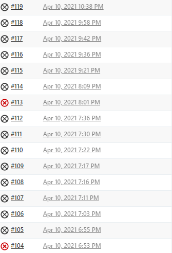

# OneCleverHorse
Author: Suner Syuleyman - who is currently ill

A docker swarm password generator based on an XKCD cartoon

# Architecture

## Micro-service architecture example 

                  Web Client
    {            Load Balancer             }    
    [               Docker                 ]    
    DB Stack -> APP Stack -> Webfront Stack     
    (DB INST)   (APP INST)   (WEB INST)
    (DB INST)   (APP INST)   (WEB INST)
    (DB INST)   (APP INST)   (WEB INST)
    (DB INST)   (APP INST)   (WEB INST)
    (DB INST)   (APP INST)   (WEB INST)
    (DB INST)   (APP INST)   (WEB INST)
    (DB INST)   (APP INST)   (WEB INST)

## Service 1
Front end, powered by Flask, HTML, CSS and Javascript. Assembles everything and shows it all nicely using Twitter Bootstrap styling.
## Service 2
Fetches random nouns from a list.
## Service 3
Fetches random adjectives from a list.
## Service 4
Is a combiner that generates a combined string for Service 1.

## Production Environment

This is the architecture design for the current deployment. What it does is it hosts most of the services inside a Docker Swarm, that then meets with NGINX to hide the back end and show the end product to the user. For a database I am using a fully managed Relational MYSQL Database by GCP.

This is how it looks like on the GCP Cloud Console.

The old layout includes a lot of extra services. It's biggest failure was to resolve DNS names inside the private network. 

This resulted in this new layout that is all based in eu-west-2a and that helps Ansible and Jenkins to be able to call servers by name due to dynamic IPs

# Development Environment
## GCP Server Setup
1. Boot up GCP Server
2. Edit instance and place key gennereated using     ssh-keygen
3. ssh into server public IPv4 using Powershell
4. Use VSCode Plug in to now connect into the server which should be listed as a remote connection. 

For more info : <https://code.visualstudio.com/docs/remote/ssh>

## Tools

+ Ubuntu 18.04 - Development environement. Chosen for its stability and LTS support. 
+ MS Visual Studio Code - Requirement of the project and a nice tool to use with loads of plugins.
+ Twitter Bootstrap 5 - Quick CSS Styling.
+ Jenkins - Open source CI/CD pipeline builder. Very flexible in its implementation.
+ Docker - Simple container maker.
+ Docker Swarm - Simple deployment
+ Trello - Kanban board of choice

## Takeaways from previous project

1. Avoid feature creep, really trim this project <https://github.com/78afec35/Personal-Project>
2. Focus on success early on by reading the requirements < Requirements unclear
3. Integrate early on. < Pipeline has been the focus of this project

## Kanban board

Using Trello as a kanban board - <https://trello.com/b/Ko3b7CXN/onecleverhorse>

## Docker Compose Installation Script

    # make sure jq & curl is installed
    sudo apt update
    sudo apt install -y curl jq
    # set which version to download (latest)
    version=$(curl -s https://api.github.com/repos/docker/compose/releases/latest | jq -r '.tag_name')
    # download to /usr/local/bin/docker-compose
    sudo curl -L "https://github.com/docker/compose/releases/download/${version}/docker-compose-$(uname -s)-$(uname -m)" -o /usr/local/bin/docker-compose
    # make the file executable
    sudo chmod +x /usr/local/bin/docker-compose

## Docker Swarm - Worker Creation Startup Script

    #!/bin/bash 
    sudo apt update
    sudo apt install build-essential -y 
    sudo apt install docker.io -y
    sudo groupadd docker
    sudo gpasswd -a $USER docker
    sudo su - 
    sudo su jenkins
    docker swarm join --token SWMTKN-1-5qh189liw1ahad0yen6kbf6stl0qxkez1144wn7azwg4w9ide8-7jgw3pql5nlkvii8f2ejht9pi 10.154.0.9:2377

# Continuous integration / Continuous deployment
This is the complete pipeline at the moment. 

1. Webhooks fetch the github repository.
2. The local Jenkins server is cleaned and the up to date repo is cloned down.
3. The Jenkins server is set up to ensure it is running properly. 
4. Pytest is run against the code. 
5. Docker-Compose builds all the images according to its manifest. 
6. Images are tagged and pushed to DockerHub.
7. Images are then pulled down again and ran through a test deployment stage where they deploy on the Jenkins server to ensure they are working. 
8. Jenkins server is wiped and all docker images removed. 
9. Ansible configures the swarm and reverse proxy. 
10. Jenkins performs and SSH connection into the manager and spins up the containers in it.

This is where I encounter a killer error that I cannot fix at the moment. I am not sure entirely where it originates. However it leads this pipeline to stall out as it cannot complete the deployment. 

The most likely cause for this is that servies are span up in the workers and don't show up on the manager. I am not sure why that is. 

Troubleshooting stages so far include : 
1. Destroying and recreating the server. 
2. Removing tags or any kind of capitalisation.
3. Reinstalling docker and all prerequisites. 
4. Scaling services up and down. 

## Github - Version control system

Git hub has been used as a version control system. It includes a main branch, a dev branch and a feature branch. 

## Jenkins - Pipeline and testing

Jenkins has been part of the development process since the start this time. 
You can inspect it on this address <http://34.89.33.141:8080/job/OneCleverHorse/>
Credentials set up for you:

user: Jenkins

password: Jenkins

 

As you can see a lot of builds are aborted however due to the previous error that doesn't allow them to complete.

## Docker Repository - Artifact Repository

Docker Hub was used as an artifact repository for this project. 

Here my renaming attempts can be seen. 

I initially used BUILD_NUMBER environment variable in Jenkins to automatically tag each build this was lated scrapped as I was trying to complete pipeline and it was interfering with the deployment process. 

# Risk Assesment

## SWOT Analysis

### Strengths
+ Detailed pipeline
+ Unique Idea
+ Relatively easy to execute
### Weaknesses
+ Incomplete
+ Vulnerable to scaling issues
+ Very poor availability from a single AZ
### Opportunities
+ Can be integrated in an infrastructure as code solution to address some of the weaknesses
### Threats
+ No real security measures aside from using a secrets manager and a reverse proxy. 
+ Vulnerable to common attacks. 

## Risk assessment Matrix and Particular Issues

        1   2   3   4   5 < Severity
    1   Y   O   O   R   R
    2   Y   Y   O   O   R
    3   G   Y   O   O   R
    4   G   Y   Y   O   O
    5   G   G   Y   Y   O
    ^ 
    Likelyhood

    G = Green
    Y = Yellow
    O = Orange
    R = Red
    example: 5-3  Very Unlikely, Medium Severity

### 1-5 Category: RED. Almost Certain, Catastropic Severity - Developer is ill. 

I am rather ill. This has impacted my ability to work. As such I haven not managed to complete this project. 

### 1-5 Category: RED Almost Certain, Catastropic Severity - Docker Swarm error

Docker Swarm is exhibiting buggy behaviour where it either is not correctly reporting the number of container replicas or it is failing to bring them up.
It is possible that is failing to mention some kind of prerequisite required for it to run. As was found yesterday when it needed docker compose to read the docker-compose.yaml file correctly. 

### 1-5 Category: RED Almost Certain, Catastropic Severity - Requirements unclear until a few days ago.

Project requirements have been kept secret from this cohort untill very recently. As a timeline: 
1. This project didn't exist
2. This project was unlikely
3. This project was now happening
4. This project isn't that important
5. This project doesn't have that many tools you can do it an hour. 
6. Failing this project means you fail the cohort. 
7. Oh you have to use Ansible, don't worry I will teach you now. 

The actual document we were provided in the beginning doesn't go into detail of the requirements, whilst the actual marking is very particular of what is required of us. That is unfair. 

### 5-5 Category: ORANGE Rare, Catastropic Severity - Poor Availibity and Elasticity

For me it is unlikely that this is going to be a production application. However if this was a production environment the risk rating would have been upgraded. Mostly because this is with regards to the application's poor availibity and scalability. 

These aspects of the application are handled manually and are prone to human error. 

More so a human cannot correctly anticipate demand and so it would definately result in website downtime.

### 5-5 Category: ORANGE Rare, Catastropic Severity - Poor Credentials Management

Docker Credentials have to be inputted manually which further adds to technical debt in this project. It requires some manual touch ups to both Ansible and Jenkins to ensure they work. Such as handling evnironment variables over SSH connections and the like.

### 5-5 Category: ORANGE Rare, Catastropic Severity - MYSQL is a seperate service and cannot be handled effectively using Ansible

This results in the Database not being part of the CI/CD pipeline and becoming vulnerable to configuration errors and mismanagement.

